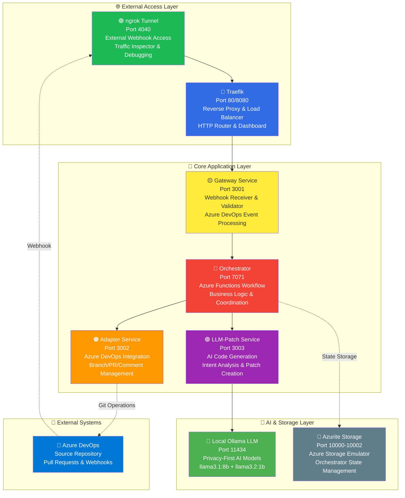
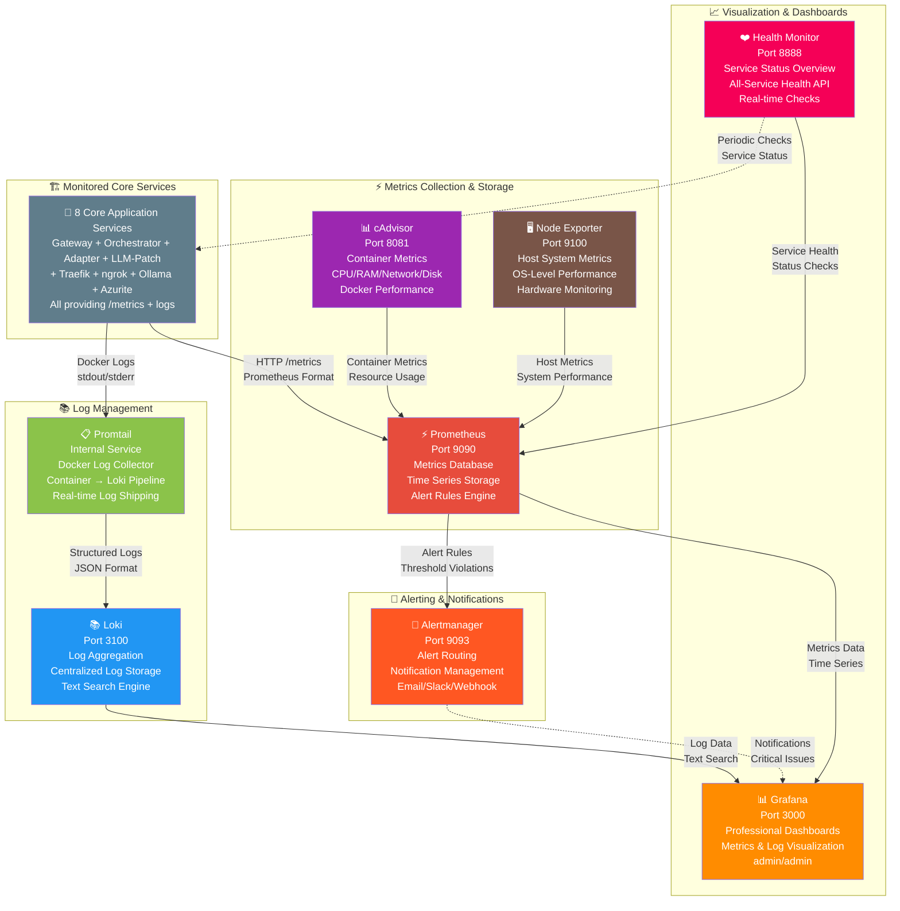

# 🤖 AI Code Agent

> **An intelligent AI agent that automatically creates code changes in Azure DevOps Pull Requests**

## ⚠️ Development Status

🚧 **This project is currently in active development** but already functional for core workflows.

## 🎯 What does this Agent do?


**🎯 Core Value Proposition:**
- **Natural Language Processing**: Write simple comments like "@user /edit /2 make buttons red" instead of manual code changes
- **Contextual AI Generation**: The agent understands your existing codebase and creates relevant modifications
- **Multiple Variants**: Get 1-10 different implementation approaches to compare and choose from
- **Seamless Integration**: Works directly within your existing Azure DevOps Pull Request workflow
- **Privacy-First**: Runs locally with Ollama LLM (no external API calls required)
- **Production-Ready**: Built with enterprise-grade observability, monitoring, and scalability

### ✨ Simple Usage

1. **Write a comment** in your Azure DevOps Pull Request:
   ```
   @"User" /edit /2 Make all buttons red and add hover effects
   ```

2. **The Agent automatically creates:**
   - 🔀 2 separate branches (`agents/edit-123-1`, `agents/edit-123-2`) **based on your current PR**
   - 📝 Code patches with AI-generated changes **applied to your existing code**
   - 🔄 Draft Pull Requests with the variants **targeting the same base branch**
   - 💬 Status updates **posted back to your original PR** showing progress

3. **You receive:**
   - Different solution approaches to compare **within your PR context**
   - Immediately testable code variants **built on your existing changes**
   - Detailed explanations of the changes **relevant to your current work**

## 🏗️ System Architecture

> **Production-ready architecture** designed with **observability**, **resilience**, and **scalability** in mind.

### � Architecture Documentation

📁 **Complete Architecture Documentation**: [`/docs`](./docs)
- 🎯 **[Project Goals & SLOs](./docs/goal.md)** - Business objectives and service level objectives
- 🏗️ **[Arc42 Architecture](./docs/arc42)** - Comprehensive system documentation  
- 📝 **[Architecture Decisions (ADRs)](./docs/adr)** - Key technical decisions and rationale
- 🎨 **[C4 Models](./docs/c4/workspace.dsl)** - Visual architecture models and diagrams

### 🔄 Complete System Architecture & Workflow

```mermaid
graph TB
    subgraph "👤 External Systems & Users"
        DEV[🧑‍💻 Developer<br/>Azure DevOps User<br/>Writes PR Comments<br/>@user /edit /N intent]
        ADO[🔵 Azure DevOps<br/>Source Repository<br/>Pull Requests & Webhooks<br/>Project Management]
        EXTERNAL[🌐 External Access<br/>ngrok Public Tunnel<br/>Webhook Endpoint<br/>Traffic Inspector]
    end
    
    subgraph "🏗️ Core Application Services (8 Services)"
        direction TB
        TRAEFIK[🔷 Traefik<br/>Port 80/8080<br/>Reverse Proxy & Load Balancer<br/>HTTP Router & Dashboard]
        GATEWAY[🟡 Gateway Service<br/>Port 3001<br/>Webhook Receiver & Validator<br/>Azure DevOps Event Processing]
        ORCHESTRATOR[🔴 Orchestrator<br/>Port 7071<br/>Azure Functions Workflow<br/>Business Logic & Coordination]
        ADAPTER[🟠 Adapter Service<br/>Port 3002<br/>Azure DevOps Integration<br/>Branch/PR/Comment Management]
        LLM_PATCH[🟣 LLM-Patch Service<br/>Port 3003<br/>AI Code Generation<br/>Intent Analysis & Patch Creation]
        OLLAMA[🧠 Local Ollama LLM<br/>Port 11434<br/>Privacy-First AI Models<br/>llama3.1:8b + llama3.2:1b]
        NGROK[🟢 ngrok Tunnel<br/>Port 4040<br/>External Webhook Access<br/>Traffic Inspector & Debugging]
        AZURITE[💽 Azurite Storage<br/>Port 10000-10002<br/>Azure Storage Emulator<br/>Orchestrator State Management]
    end
    
    subgraph "📊 Monitoring & Observability Stack (8 Services)"
        direction TB
        HEALTH_MON[🏥 Health Monitor<br/>Port 8888<br/>Automated Service Health<br/>All-Service Status API]
        GRAFANA[📈 Grafana<br/>Port 3000<br/>Professional Dashboards<br/>Metrics Visualization]
        PROMETHEUS[⚡ Prometheus<br/>Port 9090<br/>Metrics Database<br/>Alert Rules & TSDB]
        LOKI[📚 Loki<br/>Port 3100<br/>Log Aggregation<br/>Centralized Log Storage]
        PROMTAIL[📋 Promtail<br/>Internal Service<br/>Docker Log Collector<br/>Container → Loki Pipeline]
        CADVISOR[📊 cAdvisor<br/>Port 8081<br/>Container Metrics<br/>CPU/RAM/Network/Disk]
        NODE_EXP[🖥️ Node Exporter<br/>Port 9100<br/>Host System Metrics<br/>OS-Level Performance]
        ALERTMGR[🔔 Alertmanager<br/>Port 9093<br/>Alert Routing<br/>Notification Management]
    end
    
    subgraph "🤖 AI Provider Chain (Fallback Strategy)"
        direction LR
        AI_LOCAL[🏠 Local Ollama<br/>1st Priority<br/>Privacy & No Cost<br/>llama3.1:8b]
        AI_CLAUDE[🎭 Anthropic Claude<br/>2nd Priority<br/>Enterprise Quality<br/>API Key Required]
        AI_OPENAI[🤖 OpenAI GPT-4<br/>3rd Priority<br/>Fallback Option<br/>API Key Required]
        AI_MOCK[🎪 Mock Responses<br/>Final Fallback<br/>No Dependencies<br/>Testing & Demo]
    end
    
    %% Main Workflow - PR Comment to AI Code Generation
    DEV -->|1. PR Comment<br/>@user /edit /N intent| ADO
    ADO -->|2. Webhook Event<br/>Pull Request Commented| EXTERNAL
    EXTERNAL -->|3. HTTP Request<br/>/webhook/ado| TRAEFIK
    TRAEFIK -->|4. Route Request| GATEWAY
    GATEWAY -->|5. Process & Validate<br/>Webhook Event| ORCHESTRATOR
    
    %% Orchestrator Coordination (Azure Functions)
    ORCHESTRATOR -->|6a. Fetch PR Metadata<br/>Files & Context| ADAPTER
    ORCHESTRATOR -->|6b. Generate AI Patches<br/>N Variants| LLM_PATCH
    ORCHESTRATOR -->|6c. Create Feature Branches<br/>agents/edit-prId-variant| ADAPTER
    ORCHESTRATOR -->|6d. Apply Patches<br/>Commit Changes| ADAPTER
    ORCHESTRATOR -->|6e. Create Draft PRs<br/>Review-Ready| ADAPTER
    ORCHESTRATOR -->|6f. Post Status Updates<br/>Progress Comments| ADAPTER
    
    %% AI Provider Chain (Priority Order)
    LLM_PATCH -.->|1st Choice: Local AI<br/>Privacy + No Cost| AI_LOCAL
    LLM_PATCH -.->|2nd Choice: Enterprise AI<br/>High Quality| AI_CLAUDE
    LLM_PATCH -.->|3rd Choice: Fallback AI<br/>Reliable Option| AI_OPENAI
    LLM_PATCH -.->|Final Fallback: Mock<br/>No Dependencies| AI_MOCK
    
    %% Azure DevOps Integration
    ADAPTER <-->|REST API Calls<br/>CRUD Operations| ADO
    
    %% Infrastructure Dependencies
    ORCHESTRATOR -.->|State Storage<br/>Workflow Persistence| AZURITE
    TRAEFIK -->|Load Balance<br/>Health Checks| GATEWAY
    TRAEFIK -->|Route Traffic<br/>Service Discovery| ADAPTER
    TRAEFIK -->|Route Traffic<br/>Service Discovery| LLM_PATCH
    
    %% Monitoring Data Flow
    PROMTAIL -->|Collect Logs<br/>Docker Containers| LOKI
    CADVISOR -->|Container Metrics<br/>Resource Usage| PROMETHEUS
    NODE_EXP -->|Host Metrics<br/>System Performance| PROMETHEUS
    GATEWAY -->|Service Metrics<br/>Request/Response| PROMETHEUS
    ADAPTER -->|Service Metrics<br/>API Calls| PROMETHEUS
    LLM_PATCH -->|Service Metrics<br/>AI Performance| PROMETHEUS
    ORCHESTRATOR -->|Service Metrics<br/>Workflow Stats| PROMETHEUS
    
    %% Observability Stack
    PROMETHEUS -->|Metrics Data<br/>Time Series| GRAFANA
    LOKI -->|Log Data<br/>Text Search| GRAFANA
    PROMETHEUS -->|Alert Rules<br/>Threshold Monitoring| ALERTMGR
    HEALTH_MON -->|Service Health<br/>Status Aggregation| PROMETHEUS
    
    %% External Access
    NGROK -->|Tunnel Traffic<br/>Webhook Endpoint| TRAEFIK
    
    %% Service Health Monitoring
    HEALTH_MON -.->|Health Checks<br/>Service Status| GATEWAY
    HEALTH_MON -.->|Health Checks<br/>Service Status| ADAPTER
    HEALTH_MON -.->|Health Checks<br/>Service Status| LLM_PATCH
    HEALTH_MON -.->|Health Checks<br/>Service Status| TRAEFIK
    HEALTH_MON -.->|Health Checks<br/>Service Status| OLLAMA
    
    %% Styling
    style DEV fill:#e3f2fd
    style ADO fill:#0078d4,color:#fff
    style EXTERNAL fill:#1db954,color:#fff
    style TRAEFIK fill:#326ce5,color:#fff
    style GATEWAY fill:#ffeb3b
    style ORCHESTRATOR fill:#f44336,color:#fff
    style ADAPTER fill:#ff9800,color:#fff
    style LLM_PATCH fill:#9c27b0,color:#fff
    style OLLAMA fill:#4caf50,color:#fff
    style NGROK fill:#1db954,color:#fff
    style AZURITE fill:#607d8b,color:#fff
    style HEALTH_MON fill:#f50057,color:#fff
    style GRAFANA fill:#ff8c00,color:#fff
    style PROMETHEUS fill:#e74c3c,color:#fff
    style LOKI fill:#2196f3,color:#fff
    style PROMTAIL fill:#8bc34a,color:#fff
    style CADVISOR fill:#9c27b0,color:#fff
    style NODE_EXP fill:#795548,color:#fff
    style ALERTMGR fill:#ff5722,color:#fff
    style AI_LOCAL fill:#4caf50,color:#fff
    style AI_CLAUDE fill:#673ab7,color:#fff
    style AI_OPENAI fill:#00bcd4,color:#fff
    style AI_MOCK fill:#9e9e9e,color:#fff
```



### 🏗️ Core Application Services (8 Services)

**Purpose:** Core services for AI Code Generation and Azure DevOps Integration.



**Core Application Services - Architecture Details:**

| Service | Purpose | Interactions | Technology Choice & Scalability |
|---------|---------|--------------|--------------------------------|
| **ngrok** | External Tunnel & Webhook Access | Azure DevOps → Traefik | Secure tunneling without firewall config, instant scaling |
| **Traefik** | Reverse Proxy & Load Balancer | ← ngrok → Gateway/Adapter/LLM-Patch | Modern cloud-native proxy, auto-discovery, horizontal scaling |
| **Gateway** | Webhook Receiver & Event Validator | ← Traefik → Orchestrator | Single entry point, rate limiting, easy to scale horizontally |
| **Orchestrator** | Azure Functions Workflow Engine | ← Gateway → Adapter + LLM-Patch | Serverless auto-scaling, pay-per-execution, fault tolerance |
| **Adapter** | Azure DevOps Integration & Git Operations | ← Orchestrator ↔ Azure DevOps | Specialized service, stateless design, parallel processing |
| **LLM-Patch** | AI Code Generation & Intent Analysis | ← Orchestrator → Ollama | Dedicated AI workload, GPU scalable, model hot-swapping |
| **Ollama** | Local LLM (llama3.1:8b + llama3.2:1b) | ← LLM-Patch (AI Generation) | Privacy-first, no API costs, local GPU acceleration |
| **Azurite** | Azure Storage Emulator | ← Orchestrator (State Management) | Development storage, easy cloud migration, consistent API |

### 📊 Monitoring & Observability Stack (8 Services)

**Purpose:** Professional monitoring, metrics, logs and alerting for all services.



**Automatisierte Überwachung aller 16 Services mit professionellen Tools:**

The AI Code **Professional Monitoring & Observability - All 8 Services:**

| Service | Purpose | Interactions | Technology Choice & Scalability |
|---------|---------|--------------|--------------------------------|
| **Health Monitor** | Automated Service Health Monitoring | Checks all 15 services → Prometheus | Custom health aggregator, real-time checks, horizontally scalable |
| **Grafana** | Professional Dashboards & Visualization | ← Prometheus + Loki | Industry standard, plugin ecosystem, multi-tenant ready |
| **Prometheus** | Metrics Database & Time Series Storage | ← cAdvisor + Node Exporter + All Services | Cloud-native monitoring, HA clustering, federation support |
| **Loki** | Log Aggregation & Search Engine | ← Promtail (All Container Logs) | Prometheus-like labels, cost-effective storage, cloud-native |
| **cAdvisor** | Container Metrics & Resource Monitoring | All Containers → Prometheus | Google-developed, minimal overhead, Kubernetes-ready |
| **Node Exporter** | Host System Metrics Collection | Host System → Prometheus | Prometheus standard, minimal footprint, production-proven |
| **Alertmanager** | Alert Routing & Notification Management | ← Prometheus (Alert Rules) | Prometheus ecosystem, sophisticated routing, multi-channel |
| **Promtail** | Docker Log Collection Agent | All Containers → Loki | Loki ecosystem, efficient shipping, label extraction |onds to natural language** in Azure DevOps Pull Request comments and **automatically creates code variants** as separate Draft Pull Requests **from the same codebase context** where the comment was posted.

## 🚀 Quick Start

### 1. Start Complete System
```bash
git clone <repository>
cd ai-code-agent

# Configure environment
cp .env.example .env
# Add your tokens (ngrok, Azure DevOps PAT, etc.)

# Start ALL 16 services with ONE command
docker-compose -f docker-compose.full.yml up -d --build

# Wait for services to initialize
echo "Waiting for services to start..."
Start-Sleep -Seconds 60

# Check if Ollama models are installed
docker exec agent-local-llm ollama list
```

### 2. Health Check & Service Verification
```bash
# Quick health check of all 15 services
curl http://localhost:8888/health

# Access monitoring dashboards
# Grafana: http://localhost:3000 (admin/admin)
# Prometheus: http://localhost:9090
# Health Monitor: http://localhost:8888
```

### 3. Configure Azure DevOps Webhook
1. Get ngrok tunnel URL: http://localhost:4040
2. Go to **Project Settings → Service Hooks** in Azure DevOps
3. Create **"Pull request commented"** Webhook
4. URL: `<ngrok-tunnel-url>/webhook/ado`
5. Secret: From your `.env` file (`WEBHOOK_SECRET`)

### 4. Test the System
Write in a PR comment:
```
@YourUsername /edit /1 Add error handling to the login function
```

## 📋 Complete Service Overview

### Core Application Services (8)
| Port | Service | Container | Purpose | Interactions |
|------|---------|-----------|---------|-------------|
| 80/8080 | **Traefik** | agent-traefik | Load Balancer & Reverse Proxy | ← ngrok → Gateway |
| 3001 | **Gateway** | agent-gateway | API Gateway for Azure DevOps Webhooks | ← Traefik → Orchestrator |
| 3002 | **Adapter** | agent-adapter | Azure DevOps Integration (Branch/PR Management) | ← Orchestrator ↔ Azure DevOps |
| 3003 | **LLM-Patch** | agent-llm-patch | AI Code Generation & Intent Analysis | ← Orchestrator → Ollama |
| 7071 | **Orchestrator** | agent-orchestrator | Azure Functions Workflow Coordination | ← Gateway → Adapter + LLM-Patch |
| 4040 | **ngrok** | agent-ngrok | External Tunnel (Azure DevOps → Local) | ← Azure DevOps → Traefik |
| 11434 | **Ollama** | agent-local-llm | Local LLM (llama3.1:8b + llama3.2:1b) | ← LLM-Patch (AI Generation) |
| 10000-10002 | **Azurite** | agent-azurite | Azure Storage Emulator | ← Orchestrator (State Storage) |

### Monitoring & Observability (8)
| Port | Service | Container | Purpose | Data Sources |
|------|---------|-----------|---------|-------------|
| 8888 | **Health Monitor** | agent-health-monitor | Automated Health Checks of All Services | → All 15 services |
| 3000 | **Grafana** | agent-grafana | Monitoring Dashboards & Visualization | ← Prometheus + Loki |
| 9090 | **Prometheus** | agent-prometheus | Metrics Database & Alert Rules | ← cAdvisor + Node Exporter |
| 9100 | **Node Exporter** | agent-node-exporter | Host System Metrics (CPU, RAM, Disk) | → Prometheus |
| 8081 | **cAdvisor** | agent-cadvisor | Container Metrics (CPU, RAM, Network) | → Prometheus |
| 3100 | **Loki** | agent-loki | Log Aggregation & Search Engine | ← Promtail |
| 9093 | **Alertmanager** | agent-alertmanager | Alert Notifications & Routing | ← Prometheus |
| Internal | **Promtail** | agent-promtail | Docker Log Collection Agent | ← All containers → Loki |

### Infrastructure & Storage (1)
| Port | Service | Container | Purpose | Used By |
|------|---------|-----------|---------|---------|
| 10000-10002 | **Azurite** | agent-azurite | Azure Storage Emulator | ← Orchestrator (State Storage) |

## 🔧 System Requirements

### Required
- **Docker & Docker Compose** (latest)
- **ngrok Account** with Auth Token (Free tier works)
- **Azure DevOps** Project with Admin rights

### LLM Configuration
The system includes **Ollama** for local AI generation:
- ✅ **Free & Private** - No API costs, runs completely offline
- ✅ **Auto-configured** - llama3.1:8b + llama3.2:1b models
- ⚠️ **Hardware requirements** - 8GB+ RAM recommended for llama3.1:8b

## 📖 Additional Documentation

- **[AgentDocs/Agent_Init.md](./AgentDocs/Agent_Init.md)** - Complete system startup & health checks
- **[Agent.md](Agent.md)** - Detailed service overview
- **[AgentDocs/](AgentDocs/)** - Technical documentation & troubleshooting

## 🎯 Usage Examples

### Simple Code Change
```
@"User" /edit /1 Add null checks to the user validation function
```

### Multiple Variants  
```
@"User" /edit /3 Refactor the authentication logic to use JWT tokens
```

### UI Changes
```
@"User" /edit /2 Make the navigation menu responsive and add dark mode
```

## 📊 Service Health & Monitoring

- **Real-time Health**: http://localhost:8888
- **Application Metrics**: http://localhost:9090 (Prometheus)
- **Dashboards**: http://localhost:3000 (Grafana - admin/admin)
- **Log Search**: http://localhost:3000/explore (Loki in Grafana)
- **ngrok Inspector**: http://localhost:4040/inspect/http

## 📄 License

This project is licensed under the **MIT License** - see the [LICENSE](LICENSE) file for details.

---

*For technical details and troubleshooting see [AgentDocs/Agent_Init.md](./AgentDocs/Agent_Init.md)*
Enterprise docs trigger: 09/10/2025 01:07:14
