# 🤖 AI Code Agent

> **An intelligent AI agent that automatically creates code changes in Azure DevOps Pull Requests**

## ⚠️ Development Status

🚧 **This project is currently in active development** but already functional for core workflows.


## 🎯 What does this Agent do?

The AI Code Agent **responds to natural language** in Azure DevOps Pull Request comments and **automatically creates code variants** as separate Draft Pull Requests **from the same codebase context** where the comment was posted.

### ✨ Simple Usage

1. **Write a comment** in your Azure DevOps Pull Request:
   ```
   @"User" /edit /2 Make all buttons red and add hover effects
   ```

2. **The Agent automatically creates:**
   - 🔀 2 separate branches (`agents/edit-123-1`, `agents/edit-123-2`) **based on your current PR**
   - 📝 Code patches with AI-generated changes **applied to your existing code**
   - 🔄 Draft Pull Requests with the variants **targeting the same base branch**
   - 💬 Status updates **posted back to your original PR** showing progress

3. **You receive:**
   - Different solution approaches to compare **within your PR context**
   - Immediately testable code variants **built on your existing changes**
   - Detailed explanations of the changes **relevant to your current work**

## 🔄 How does it work?

```mermaid
graph TB
    A[👤 Developer writes PR comment<br/>@username /edit /N description] --> B[🌐 Azure DevOps Webhook]
    B --> C[🚪 Gateway Service]
    C --> D[🎯 Orchestrator]
    
    D --> E[📋 Adapter: Fetch PR data]
    D --> F[🤖 LLM-Patch: Generate code]
    D --> G[🌳 Adapter: Create branches]
    D --> H[📝 Adapter: Commit code]
    D --> I[🔄 Adapter: Create Draft PRs]
    
    E --> J[📊 Azure DevOps API]
    F --> K[🧠 Claude/OpenAI/Ollama/vLLM/TGI]
    G --> J
    H --> J
    I --> J
    
    style A fill:#e1f5fe
    style D fill:#f3e5f5
    style F fill:#fff3e0
    style J fill:#e8f5e8
```



## 🚀 Quick Start

### 1. Start System
```bash
git clone <repository>
cd ai-code-agent

# Configure environment
cp .env.example .env
# Add your tokens (ngrok, OpenAI, etc.)

# Start all services
docker-compose up -d --build

# Wait for services to initialize (especially Ollama)
echo "Waiting for services to start..."
sleep 45

# IMPORTANT: Check if Ollama model is installed
echo "Checking Ollama LLM Models..."
docker exec agent-local-llm ollama list | grep -q "llama3.2:1b" && echo "✅ Ollama Model: Ready" || {
    echo "📥 Installing llama3.2:1b model (1.3GB download)..."
    docker exec agent-local-llm ollama pull llama3.2:1b
    echo "✅ Model installation complete"
}
```

### 2. Access Important Services
| Service | URL | Purpose |
|---------|-----|---------|
| 🌐 **ngrok Tunnel** | http://localhost:4040 | **Webhook URL for Azure DevOps** |

### 3. Configure Azure DevOps
1. Go to **Project Settings → Service Hooks**
2. Create **"Pull request commented"** Webhook
3. URL: `<ngrok-tunnel-url>/webhook/ado` (from http://localhost:4040)
4. Secret: From your `.env` file

### 4. Test
Write in a PR comment:
```
@Arthur-schwan /edit /1 Add error handling to the login function
```

## 📋 Service Overview

### Core Application Services
| Port | Service | Container | Purpose | Status Check |
|------|---------|-----------|---------|--------------|
| 80 | Proxy | aiforcoding-proxy-1 | Reverse Proxy & Load Balancer | `curl http://localhost:80` |
| 8080 | Gateway | aiforcoding-gateway-1 | API Gateway for Azure DevOps Webhooks | `curl http://localhost:8080/health` |
| 8082 | Adapter | aiforcoding-adapter-1 | Azure DevOps Integration (Branch/PR) | `curl http://localhost:8082/health` |
| 4040 | ngrok Tunnel | aiforcoding-ngrok-1 | External Webhook Access & Traffic Inspector | `curl http://localhost:4040/api/tunnels` + `http://localhost:4040/inspect/http` |
| 11434 | Ollama | aiforcoding-ollama-1 | Local LLM (llama3.1:8b) | `curl http://localhost:11434/api/version` |
| Internal (7071) | Orchestrator | aiforcoding-orchestrator-1 | Azure Functions Workflow Orchestration | `docker logs aiforcoding-orchestrator-1 --tail 5` |
| Internal | LLM-Patch | aiforcoding-llm-patch-1 | Code Generation & Intent Analysis | `docker logs aiforcoding-llm-patch-1 --tail 5` |

### Monitoring & Observability
| Port | Service | Container | Purpose | Status Check |
|------|---------|-----------|---------|--------------|
| 3000 | Grafana | agent-grafana | Monitoring Dashboard | `curl http://localhost:3000` |
| 9090 | Prometheus | agent-prometheus | Metrics Collection | `curl http://localhost:9090` |
| 9100 | Node Exporter | agent-node-exporter | System Metrics | `curl http://localhost:9100/metrics` |
| 8081 | cAdvisor | agent-cadvisor | Container Metrics | `curl http://localhost:8081/containers/` |

### Infrastructure & Storage
| Port | Service | Container | Purpose | Status Check |
|------|---------|-----------|---------|--------------|
| 8090 | Traefik Dashboard | aiforcoding-traefik-1 | Load Balancer UI | `curl http://localhost:8090` |
| 8088 | Traefik API | aiforcoding-traefik-1 | Routing API | `curl http://localhost:8088/api/version` |
| 8443 | Traefik HTTPS | aiforcoding-traefik-1 | SSL/TLS Endpoint | `docker logs aiforcoding-traefik-1` (SSL config needed ) |
| 10000-10002 | Azurite | aiforcoding-azurite-1 | Azure Storage Emulator | `docker logs aiforcoding-azurite-1 --tail 3` |

## 🏗️ Detailed Architecture


## 🔧 System Requirements

### Required
- **Docker & Docker Compose** (latest)
- **ngrok Account** with Auth Token (Free tier works)
- **Azure DevOps** Project with Admin rights

### LLM Agent (Choose One - Required for Code Generation)
**You need at least one LLM option:**

#### 🐳 **Container-based LLMs (Recommended)**
- **Ollama Container** - `agent-local-llm` (included, Port 11434)
  - ✅ **Free & Private** - No API costs, runs completely offline
  - ✅ **Auto-configured** - Works out of the box with llama3.2:1b
  - ⚠️ **Requires model download** - 1.3GB download on first run
  - ⚠️ **Hardware requirements** - 4GB+ RAM recommended
- **vLLM Container** - High-performance inference server
- **Text Generation Inference (TGI)** - HuggingFace production server  
- **LocalAI** - OpenAI-compatible API for local models

#### 🌐 **External API Keys**
- OpenAI API Key (GPT-4)
- Anthropic Claude API Key  
- Azure OpenAI Credentials

**💡 Recommendation:** Use the included Ollama container for development - it's free, private, and already configured!

## 📖 Additional Documentation

- **[Agent.md](Agent.md)** - Detailed service overview and navigation
- **[AgentDocs/](AgentDocs/)** - Technical documentation
  - [System Start & Initialization](./AgentDocs/Agent_Init.md)
  - [ngrok Container Configuration](./AgentDocs/Agent_Ngrok.md)
  - [Troubleshooting Guide](./AgentDocs/Agent_Troubleshooting.md)

## 🎯 Examples

### Simple Code Change
```
@"User" /edit /1 Add null checks to the user validation function
```

### Multiple Variants
```
@"User" /edit /3 Refactor the authentication logic to use JWT tokens
```

### UI Changes
```
@"User" /edit /2 Make the navigation menu responsive and add dark mode support
```

---

## 📄 License

This project is licensed under the **MIT License** - see the [LICENSE](LICENSE) file for details.

### What this means:
- ✅ **Free to use** - Commercial and personal projects
- ✅ **Modify freely** - Adapt to your needs
- ✅ **Distribute** - Share with others  
- ✅ **Private use** - Use in closed-source projects
- ⚠️ **No warranty** - Use at your own risk

## 🤝 Contributing

Contributions are welcome! Please feel free to submit a Pull Request.

---

*For technical details and troubleshooting see [Agent.md](Agent.md)*
