# 🤖 AI Code Agent

> **An intelligent AI agent that automatically creates code changes in Azure DevOps Pull Requests**

## 🎯 What does this Agent do?

The AI Code Agent **responds to natural language** in Azure DevOps Pull Request comments and **automatically creates code variants** as separate Draft Pull Requests.

### ✨ Simple Usage

1. **Write a comment** in your Azure DevOps Pull Request:
   ```
   @Arthur-schwan /edit /2 Make all buttons red and add hover effects
   ```

2. **The Agent automatically creates:**
   - 🔀 2 separate branches (`agents/edit-123-1`, `agents/edit-123-2`)
   - 📝 Code patches with AI-generated changes
   - 🔄 Draft Pull Requests with the variants
   - 💬 Status updates in the original PR

3. **You receive:**
   - Different solution approaches to compare
   - Immediately testable code variants
   - Detailed explanations of the changes

## 🔄 How does it work?

```mermaid
graph TB
    A[👤 Developer writes PR comment<br/>@username /edit /N description] --> B[🌐 Azure DevOps Webhook]
    B --> C[🚪 Gateway Service]
    C --> D[🎯 Orchestrator]
    
    D --> E[📋 Adapter: Fetch PR data]
    D --> F[🤖 LLM-Patch: Generate code]
    D --> G[🌳 Adapter: Create branches]
    D --> H[📝 Adapter: Commit code]
    D --> I[🔄 Adapter: Create Draft PRs]
    
    E --> J[📊 Azure DevOps API]
    F --> K[🧠 Claude/OpenAI/Ollama]
    G --> J
    H --> J
    I --> J
    
    style A fill:#e1f5fe
    style D fill:#f3e5f5
    style F fill:#fff3e0
    style J fill:#e8f5e8
```



## 🚀 Quick Start

### 1. Start System
```bash
git clone <repository>
cd ai-code-agent

# Configure environment
cp .env.example .env
# Add your tokens (ngrok, OpenAI, etc.)

# Start all services
docker-compose up -d --build
```

### 2. Access Important Services
| Service | URL | Purpose |
|---------|-----|---------|
| 🌐 **ngrok Tunnel** | http://localhost:4040 | **Webhook URL for Azure DevOps** |
| 📊 **Monitoring** | http://localhost:3000 | Grafana Dashboard |
| ⚙️ **Gateway** | http://localhost:8080 | System Health Check |

### 3. Configure Azure DevOps
1. Go to **Project Settings → Service Hooks**
2. Create **"Pull request commented"** Webhook
3. URL: `<ngrok-tunnel-url>/webhook/ado` (from http://localhost:4040)
4. Secret: From your `.env` file

### 4. Test
Write in a PR comment:
```
@Arthur-schwan /edit /1 Add error handling to the login function
```

## 📋 Service Overview

### Core Application Services
| Port | Service | Container | Purpose | Status Check |
|------|---------|-----------|---------|--------------|
| 80 | Proxy | aiforcoding-proxy-1 | Reverse Proxy & Load Balancer | `curl http://localhost:80` |
| 8080 | Gateway | aiforcoding-gateway-1 | API Gateway for Azure DevOps Webhooks | `curl http://localhost:8080/health` |
| 8082 | Adapter | aiforcoding-adapter-1 | Azure DevOps Integration (Branch/PR) | `curl http://localhost:8082/health` |
| 4040 | ngrok Tunnel | aiforcoding-ngrok-1 | External Webhook Access & Traffic Inspector | `curl http://localhost:4040/api/tunnels` + `http://localhost:4040/inspect/http` |
| 11434 | Ollama | aiforcoding-ollama-1 | Local LLM (llama3.1:8b) | `curl http://localhost:11434/api/version` |
| Internal (7071) | Orchestrator | aiforcoding-orchestrator-1 | Azure Functions Workflow Orchestration | `docker logs aiforcoding-orchestrator-1 --tail 5` |
| Internal | LLM-Patch | aiforcoding-llm-patch-1 | Code Generation & Intent Analysis | `docker logs aiforcoding-llm-patch-1 --tail 5` |

### Monitoring & Observability
| Port | Service | Container | Purpose | Status Check |
|------|---------|-----------|---------|--------------|
| 3000 | Grafana | agent-grafana | Monitoring Dashboard | `curl http://localhost:3000` |
| 9090 | Prometheus | agent-prometheus | Metrics Collection | `curl http://localhost:9090` |
| 9100 | Node Exporter | agent-node-exporter | System Metrics | `curl http://localhost:9100/metrics` |
| 8081 | cAdvisor | agent-cadvisor | Container Metrics | `curl http://localhost:8081/containers/` |

### Infrastructure & Storage
| Port | Service | Container | Purpose | Status Check |
|------|---------|-----------|---------|--------------|
| 8090 | Traefik Dashboard | aiforcoding-traefik-1 | Load Balancer UI | `curl http://localhost:8090` |
| 8088 | Traefik API | aiforcoding-traefik-1 | Routing API | `curl http://localhost:8088/api/version` |
| 8443 | Traefik HTTPS | aiforcoding-traefik-1 | SSL/TLS Endpoint | `docker logs aiforcoding-traefik-1` (SSL config needed ) |
| 10000-10002 | Azurite | aiforcoding-azurite-1 | Azure Storage Emulator | `docker logs aiforcoding-azurite-1 --tail 3` |

## 🏗️ Detailed Architecture


## 🔧 System Requirements

### Required
- **Docker & Docker Compose** (latest)
- **ngrok Account** with Auth Token (Free tier works)
- **Azure DevOps** Project with Admin rights

### Optional (for LLM Features)
- OpenAI API Key
- Anthropic Claude API Key
- Azure OpenAI Credentials

## 📖 Additional Documentation

- **[Agent.md](Agent.md)** - Detailed service overview and navigation
- **[AgentDocs/](AgentDocs/)** - Technical documentation
  - [System Start & Initialization](./AgentDocs/Agent_Init.md)
  - [ngrok Container Configuration](./AgentDocs/Agent_Ngrok.md)
  - [Troubleshooting Guide](./AgentDocs/Agent_Troubleshooting.md)

## 🛠️ Health Check

Check if all services are running:
```bash
# Automatic check
./scripts/health-check.ps1

# Manual check
curl http://localhost:8080/health  # Gateway
curl http://localhost:8082/health  # Adapter
curl http://localhost:4040/api/tunnels  # ngrok
curl http://localhost:3000  # Grafana
```

## 🎯 Examples

### Simple Code Change
```
@"User" /edit /1 Add null checks to the user validation function
```

### Multiple Variants
```
@"User" /edit /3 Refactor the authentication logic to use JWT tokens
```

### UI Changes
```
@"User" /edit /2 Make the navigation menu responsive and add dark mode support
```

---

*For technical details and troubleshooting see [Agent.md](Agent.md)*
