# 🤖 AI Code Agent

> **Ein intelligenter AI-Agent, der automatisch Code-Änderungen in Azure DevOps Pull Requests erstellt**

## 🎯 Was macht dieser Agent?

Der AI Code Agent **reagiert auf natürliche Sprache** in Azure DevOps Pull Request Kommentaren und erstellt **automatisch Code-Varianten** als separate Draft Pull Requests.

### ✨ Einfache Anwendung

1. **Schreibe einen Kommentar** in deinen Azure DevOps Pull Request:
   ```
   @Arthur-schwan /edit /2 Make all buttons red and add hover effects
   ```

2. **Der Agent erstellt automatisch:**
   - 🔀 2 separate Branches (`agents/edit-123-1`, `agents/edit-123-2`)
   - 📝 Code-Patches mit AI-generierten Änderungen
   - 🔄 Draft Pull Requests mit den Varianten
   - 💬 Status-Updates im ursprünglichen PR

3. **Du erhältst:**
   - Verschiedene Lösungsansätze zum Vergleichen
   - Sofort testbare Code-Varianten
   - Detaillierte Erklärungen der Änderungen

## 🔄 Wie funktioniert es?

```mermaid
graph TB
    A[👤 Developer schreibt PR Kommentar<br/>@username /edit /N beschreibung] --> B[🌐 Azure DevOps Webhook]
    B --> C[🚪 Gateway Service]
    C --> D[🎯 Orchestrator]
    
    D --> E[📋 Adapter: PR-Daten abrufen]
    D --> F[🤖 LLM-Patch: Code generieren]
    D --> G[🌳 Adapter: Branches erstellen]
    D --> H[📝 Adapter: Code committen]
    D --> I[🔄 Adapter: Draft PRs erstellen]
    
    E --> J[📊 Azure DevOps API]
    F --> K[🧠 Claude/OpenAI/Ollama]
    G --> J
    H --> J
    I --> J
    
    style A fill:#e1f5fe
    style D fill:#f3e5f5
    style F fill:#fff3e0
    style J fill:#e8f5e8
```



## 🚀 Quick Start

### 1. System starten
```bash
git clone <repository>
cd ai-code-agent

# Environment konfigurieren
cp .env.example .env
# Trage deine Tokens ein (ngrok, OpenAI, etc.)

# Alle Services starten
docker-compose up -d --build
```

### 2. Zugang zu wichtigen Services
| Service | URL | Zweck |
|---------|-----|-------|
| 🌐 **ngrok Tunnel** | http://localhost:4040 | **Webhook URL für Azure DevOps** |
| 📊 **Monitoring** | http://localhost:3000 | Grafana Dashboard |
| ⚙️ **Gateway** | http://localhost:8080 | System Health Check |

### 3. Azure DevOps konfigurieren
1. Gehe zu **Project Settings → Service Hooks**
2. Erstelle **"Pull request commented"** Webhook
3. URL: `<ngrok-tunnel-url>/webhook/ado` (aus http://localhost:4040)
4. Secret: Aus deiner `.env` Datei

### 4. Testen
Schreibe in einen PR-Kommentar:
```
@Arthur-schwan /edit /1 Add error handling to the login function
```

## 📋 Service Overview

### Core Application Services
| Port | Service | Container | Purpose | Status Check |
|------|---------|-----------|---------|--------------|
| 80 | Proxy | aiforcoding-proxy-1 | Reverse Proxy & Load Balancer | `curl http://localhost:80` |
| 8080 | Gateway | aiforcoding-gateway-1 | API Gateway for Azure DevOps Webhooks | `curl http://localhost:8080/health` |
| 8082 | Adapter | aiforcoding-adapter-1 | Azure DevOps Integration (Branch/PR) | `curl http://localhost:8082/health` |
| 4040 | ngrok Tunnel | aiforcoding-ngrok-1 | External Webhook Access & Traffic Inspector | `curl http://localhost:4040/api/tunnels` + `http://localhost:4040/inspect/http` |
| 11434 | Ollama | aiforcoding-ollama-1 | Local LLM (llama3.1:8b) | `curl http://localhost:11434/api/version` |
| Internal (7071) | Orchestrator | aiforcoding-orchestrator-1 | Azure Functions Workflow Orchestration | `docker logs aiforcoding-orchestrator-1 --tail 5` |
| Internal | LLM-Patch | aiforcoding-llm-patch-1 | Code Generation & Intent Analysis | `docker logs aiforcoding-llm-patch-1 --tail 5` |

### Monitoring & Observability
| Port | Service | Container | Purpose | Status Check |
|------|---------|-----------|---------|--------------|
| 3000 | Grafana | agent-grafana | Monitoring Dashboard | `curl http://localhost:3000` |
| 9090 | Prometheus | agent-prometheus | Metrics Collection | `curl http://localhost:9090` |
| 9100 | Node Exporter | agent-node-exporter | System Metrics | `curl http://localhost:9100/metrics` |
| 8081 | cAdvisor | agent-cadvisor | Container Metrics | `curl http://localhost:8081/containers/` |

### Infrastructure & Storage
| Port | Service | Container | Purpose | Status Check |
|------|---------|-----------|---------|--------------|
| 8090 | Traefik Dashboard | aiforcoding-traefik-1 | Load Balancer UI | `curl http://localhost:8090` |
| 8088 | Traefik API | aiforcoding-traefik-1 | Routing API | `curl http://localhost:8088/api/version` |
| 8443 | Traefik HTTPS | aiforcoding-traefik-1 | SSL/TLS Endpoint | `docker logs aiforcoding-traefik-1` (SSL config needed ) |
| 10000-10002 | Azurite | aiforcoding-azurite-1 | Azure Storage Emulator | `docker logs aiforcoding-azurite-1 --tail 3` |

## 🏗️ Architektur im Detail


## 🔧 Systemanforderungen

### Erforderlich
- **Docker & Docker Compose** (latest)
- **ngrok Account** mit Auth Token (Free Tier funktioniert)
- **Azure DevOps** Projekt mit Admin-Rechten

### Optional (für LLM Features)
- OpenAI API Key
- Anthropic Claude API Key
- Azure OpenAI Credentials

## 📖 Weitere Dokumentation

- **[Agent.md](Agent.md)** - Detaillierte Service-Übersicht und Navigation
- **[AgentDocs/](AgentDocs/)** - Technische Dokumentation
  - [System Start & Initialization](./AgentDocs/Agent_Init.md)
  - [ngrok Container Configuration](./AgentDocs/Agent_Ngrok.md)
  - [Troubleshooting Guide](./AgentDocs/Agent_Troubleshooting.md)


## 🎯 Beispiele

### Einfache Code-Änderung
```
@"User" /edit /1 Add null checks to the user validation function
```

### Multiple Varianten
```
@"User" /edit /3 Refactor the authentication logic to use JWT tokens
```

### UI-Änderungen
```
@"User" /edit /2 Make the navigation menu responsive and add dark mode support
```

---

*Für technische Details und Troubleshooting siehe [Agent.md](Agent.md)*
