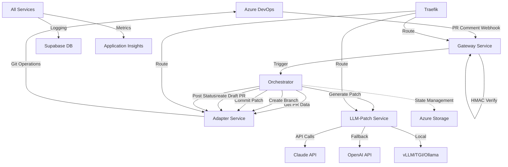

# Code Agent MVP

Ein AI-basierter Code-Editor Agent für Azure DevOps, der automatisch Code-Varianten basierend auf natürlichen Intent-Beschreibungen erstellt.

## Tech Stack & Komponenten

### Technology Stack

| **Kategorie** | **Technologie** | **Version** | **Zweck** |
|---------------|-----------------|-------------|-----------|
| **Runtime** | Node.js | 20+ | JavaScript Runtime für alle Services |
| **Sprache** | TypeScript | 5.3+ | Typisierte Entwicklung und bessere DX |
| **Web Framework** | Fastify | 4.x | Hochperformante HTTP Services (Gateway, Adapter, LLM-Patch) |
| **Orchestration** | Azure Durable Functions | v4 | Zuverlässige Workflow-Orchestrierung mit State Management |
| **Database** | Supabase (PostgreSQL) | Latest | Job-Tracking, Audit-Logs, Performance-Metriken |
| **Containerization** | Docker & Docker Compose | Latest | Lokale Entwicklung und Service-Isolation |
| **Local Tunneling** | ngrok | Latest | Webhook-Empfang während lokaler Entwicklung |
| **LLM APIs** | Claude/OpenAI/Local LLMs | Latest | Code-Patch-Generierung (vLLM, TGI, Ollama Support) |
| **Cloud Platform** | Azure | Latest | Container Apps, Functions, Key Vault, Storage |
| **🚀 Monitoring** | **Prometheus + Grafana** | **Latest** | **Enterprise-Grade Observability Stack** |
| **🚀 Metrics** | **prom-client** | **15.x** | **Production Metrics Collection** |
| **🚀 Logging** | **Loki + Promtail** | **Latest** | **Centralized Log Aggregation** |
| **🚀 Alerting** | **AlertManager** | **Latest** | **Real-time Incident Management** |

### Komponenten-Übersicht

| **Service** | **Technologie** | **Port** | **Local URL** | **Public URL** | **Zweck** | **Inputs** | **Outputs** |
|-------------|-----------------|----------|---------------|----------------|-----------|------------|-------------|
| **Gateway** | Fastify + TypeScript | 3001 | [localhost:3001](http://localhost:3001) | [ngrok Gateway](https://90aac208bed6.ngrok-free.app) | Webhook-Empfang von Azure DevOps | ADO Webhooks (HMAC-verifiziert) | Orchestrator-Trigger |
| **Orchestrator** | Azure Durable Functions | 7071 | [localhost:7071](http://localhost:7071) | - | Workflow-Management für N Varianten | EditVariantsInput | Status-Updates + Variant-Results |
| **Adapter** | Fastify + TypeScript | 3002 | [localhost:3002](http://localhost:3002) | - | Azure DevOps API Integration | Branch/PR/Comment-Requests | Git-Operationen + PR-Management |
| **LLM-Patch** | Fastify + TypeScript | 3003 | [localhost:3003](http://localhost:3003) | - | AI-basierte Code-Generierung | Intent + PR-Metadata | Unified Diffs + Explanations |
| **Shared** | TypeScript Library | N/A | - | - | Gemeinsame Types & Utilities | N/A | Contracts, Utils, Error-Handling |
| **Supabase** | PostgreSQL | 54322 | [localhost:54322](http://localhost:54322) | - | Persistente Datenhaltung | Job/Variant-Data | Audit-Logs + Metriken |
| **Traefik** | Reverse Proxy | 80/443 | [localhost:80](http://localhost:80) | [ngrok Dashboard](https://ad28e4169706.ngrok-free.app) | Load Balancing & TLS | HTTP-Requests | Service-Routing |
| **🚀 Prometheus** | **Metrics DB** | **9090** | **[localhost:9090](http://localhost:9090)** | - | **Time-Series Metrics Storage** | **Service Metrics** | **Queryable Data** |
| **🚀 Grafana** | **Dashboards** | **3000** | **[localhost:3000](http://localhost:3000)** | - | **Professional Monitoring UI** | **Prometheus Data** | **Visual Dashboards** |
| **🚀 AlertManager** | **Alerting** | **9093** | **[localhost:9093](http://localhost:9093)** | - | **Alert Routing & Notifications** | **Alert Rules** | **Slack/Email Alerts** |
| **🚀 Azurite** | **Storage Emulator** | **10000-10002** | **[Blob:10000](http://localhost:10000)** | - | **Local Azure Storage Development** | **Blob/Queue/Table** | **Storage Services** |
| **🚀 Ngrok** | **Tunnel Service** | **4040** | **[localhost:4040](http://localhost:4040)** | **[Gateway Tunnel](https://90aac208bed6.ngrok-free.app)** | **Public Webhook Access** | **Local Services** | **Public URLs** |

### Komponenten-Interaktion



### Workflow-Ablauf

| **Schritt** | **Service** | **Aktion** | **Dauer** | **Retry** |
|-------------|-------------|------------|-----------|-----------|
| 1 | Gateway | Webhook empfangen & validieren | ~50ms | 3x |
| 2 | Orchestrator | Job erstellen & N Varianten starten | ~100ms | 5x |
| 3 | Adapter | PR-Metadaten abrufen | ~500ms | 5x |
| 4 | LLM-Patch | Code-Patch für Variante K generieren | ~10-30s | 3x |
| 5 | Adapter | Branch `agents/edit-{job}-{k}` erstellen | ~200ms | 5x |
| 6 | Adapter | Patch committen | ~300ms | 5x |
| 7 | Adapter | Draft-PR öffnen | ~400ms | 5x |
| 8 | Adapter | Status-Kommentar posten | ~200ms | 5x |
| 9 | Orchestrator | Final-Status aggregieren | ~100ms | 5x |

## Überblick

Der Agent reagiert auf PR-Kommentare im Format `/edit /N <intent>` und erstellt N Varianten als separate Draft-PRs mit angewendeten Code-Patches von LLM-Services (Claude/eigene LLMs).

### Kernfeatures

- **Durable Orchestration** mit Azure Functions für zuverlässige Verarbeitung
- **Horizontal skalierbar** von lokaler Entwicklung bis Cloud-Deployment
- **Multi-Developer** Support mit isolierten Umgebungen
- **Flexibles LLM Backend** (Claude, eigene LLMs, Stubs)
- **Comprehensive Security** mit HMAC, Token-Management, Rate-Limiting

## 🚀 Quick Start (Lokal)

### 🌐 **Quick Access - Live Services**
| **🎯 Hauptzugang** | **📊 Monitoring** | **🔧 Development** | **🌐 Public Access** |
|-------------------|-------------------|-------------------|---------------------|
| [🚀 Gateway](http://localhost:3001) | [📊 Grafana](http://localhost:3000) | [⚡ Functions](http://localhost:7071) | [🌍 Public Gateway](https://90aac208bed6.ngrok-free.app) |
| [🔧 Adapter](http://localhost:3002) | [📈 Prometheus](http://localhost:9090) | [💾 Storage](http://localhost:10000) | [📊 Public Dashboard](https://ad28e4169706.ngrok-free.app) |
| [🤖 LLM-Patch](http://localhost:3003) | [🎯 Targets](http://localhost:9090/targets) | [🔍 Debug](http://localhost:9230) | [🎛️ Ngrok UI](http://localhost:4040) |

### 📋 **Setup Steps**

1. **Prerequisites**
   - Node.js 20+
   - Docker & Docker Compose
   - ngrok Account & Token
   - Azure DevOps Projekt mit Admin-Rechten

2. **System Setup (Alles starten)**
   ```bash
   cd ops/compose
   cp .env.example .env
   # .env editieren (Tokens, Secrets)
   
   # Basic Services starten
   docker-compose -f docker-compose.simple.yml up -d
   
   # 🎯 State-of-the-Art Monitoring starten
   cd ../monitoring  
   docker-compose -f docker-compose.monitoring.yml up -d
   ```

3. **Service Status prüfen**
   ```bash
   # Gateway Health Check
   curl http://localhost:3001/health
   
   # 📊 Professional Monitoring Dashboards
   curl http://localhost:3000    # Grafana (admin/admin123)
   curl http://localhost:9090    # Prometheus
   curl http://localhost:3001/metrics  # Gateway Metrics
   ```

4. **ngrok Tunnel**
   ```bash
   cd ops/dev/ngrok
   cp ngrok.yml.example ngrok.yml
   # ngrok Token eintragen
   ngrok start --all --config ngrok.yml
   ```

5. **ADO Service Hook**
   - Projekt Settings → Service Hooks
   - "Pull request commented" → `https://90aac208bed6.ngrok-free.app/gateway/webhook/ado`
   - Secret aus `.env` verwenden

6. **🎯 Monitoring Dashboards öffnen**
   - **Grafana:** [http://localhost:3000](http://localhost:3000) (Login: admin/admin123)
   - **Prometheus:** [http://localhost:9090](http://localhost:9090)
   - **Health Monitor:** [http://localhost:8888](http://localhost:8888) (Legacy)

7. **Test**
   - PR-Kommentar: `/edit /2 Make all buttons red`
   - Erwartung: Start/DONE/Final Kommentare + 2 Draft-PRs
   - **Monitoring:** Request Metrics in Grafana sichtbar

## 🌐 Development URLs & Endpoints

### 🚀 **Core Services**
| Service | URL | Public URL | Status | Zweck |
|---------|-----|------------|--------|-------|
| **Gateway** | [http://localhost:3001](http://localhost:3001) | [https://90aac208bed6.ngrok-free.app](https://90aac208bed6.ngrok-free.app) | 🟢 | Main Entry Point |
| **Adapter** | [http://localhost:3002](http://localhost:3002) | - | 🟢 | Azure DevOps Integration |
| **LLM-Patch** | [http://localhost:3003](http://localhost:3003) | - | 🟢 | AI Code Generation |
| **Orchestrator** | [http://localhost:7071](http://localhost:7071) | - | 🟢 | Azure Functions Runtime |

### 📊 **Monitoring Stack**
| Service | URL | Credentials | Public URL | Zweck |
|---------|-----|-------------|------------|-------|
| **Grafana** | [http://localhost:3000](http://localhost:3000) | admin/admin123 | - | Professional Dashboards |
| **Prometheus** | [http://localhost:9090](http://localhost:9090) | - | - | Metrics Database |
| **Prometheus Graph** | [http://localhost:9090/graph](http://localhost:9090/graph) | - | - | Query Interface |
| **Prometheus Targets** | [http://localhost:9090/targets](http://localhost:9090/targets) | - | - | Service Discovery |

### ⚡ **Development Tools**
| Service | URL | Public URL | Zweck |
|---------|-----|------------|-------|
| **Azure Functions Admin** | [http://localhost:7071/admin](http://localhost:7071/admin) | - | Function Management |
| **Azure Functions API** | [http://localhost:7071/api](http://localhost:7071/api) | - | API Endpoints |
| **Azurite Blob** | [http://localhost:10000](http://localhost:10000) | - | Azure Storage Emulator |
| **Azurite Queue** | [http://localhost:10001](http://localhost:10001) | - | Queue Service Emulator |
| **Azurite Table** | [http://localhost:10002](http://localhost:10002) | - | Table Service Emulator |
| **🌐 Ngrok Dashboard** | [http://localhost:4040](http://localhost:4040) | - | Tunnel Management |
| **🌐 Traefik Dashboard** | [http://localhost:80](http://localhost:80) | [https://ad28e4169706.ngrok-free.app](https://ad28e4169706.ngrok-free.app) | Load Balancer UI |

### 🏥 **Health Checks**
| Service | Health Endpoint | Expected Response |
|---------|----------------|-------------------|
| Gateway | [http://localhost:3001/health](http://localhost:3001/health) | `{"status":"ok"}` |
| Adapter | [http://localhost:3002/health](http://localhost:3002/health) | `{"status":"ok"}` |
| LLM-Patch | [http://localhost:3003/health](http://localhost:3003/health) | `{"status":"ok"}` |

### 🐛 **Debug Ports (VS Code Remote)**
| Service | Debug URL | VS Code Config |
|---------|-----------|----------------|
| Gateway | [http://localhost:9230](http://localhost:9230) | Node.js Debug Port |
| Adapter | [http://localhost:9231](http://localhost:9231) | Node.js Debug Port |
| LLM-Patch | [http://localhost:9232](http://localhost:9232) | Node.js Debug Port |

### 🌐 **Ngrok Public Access**
| Service | Public URL | Description |
|---------|------------|-------------|
| **🚀 Gateway (ADO Webhooks)** | [https://90aac208bed6.ngrok-free.app](https://90aac208bed6.ngrok-free.app) | **Use this for Azure DevOps Service Hooks** |
| **📊 Traefik Dashboard** | [https://ad28e4169706.ngrok-free.app](https://ad28e4169706.ngrok-free.app) | Load Balancer Management |
| **🎛️ Ngrok Tunnel UI** | [http://localhost:4040](http://localhost:4040) | Tunnel Status & Management |

## Architektur

```
User Comment → ADO Webhook → Gateway → Orchestrator
                                      ↓ (Fan-out)
                            ┌─ Variant 1 ─┐
                            ├─ Variant 2 ─┤ → Draft PRs
                            └─ Variant N ─┘
```

- **Gateway**: Webhook-Empfang, Validation, Idempotenz
- **Orchestrator**: Durable Functions für Fan-out/Fan-in Pattern
- **Adapter**: ADO REST API Integration (Branches, PRs, Comments)
- **LLM-Patch**: Code-Patch Generation via Claude/LLMs

## Deployment Optionen

- **Local Dev**: Docker Compose + ngrok
- **Azure Cloud**: Container Apps + Functions + Key Vault
- **Customer Server**: Single-VM mit Traefik + systemd

## Dokumentation

- [Architektur](docs/architecture.md) - Detaillierte Systemübersicht
- [Local Development](docs/local_dev.md) - Entwicklungssetup
- [Operations](docs/operations.md) - Monitoring, Alerts, SLOs
- [Security](docs/security.md) - Token-Management, Policies
- [Scaling](docs/scaling.md) - Horizontal Scaling Strategien

## Support

Siehe [Runbook](docs/runbook_e2e.md) für End-to-End Tests und Troubleshooting.
