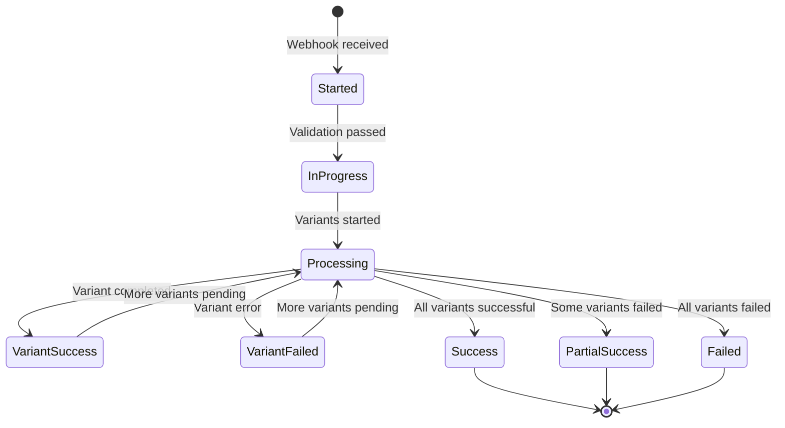

# Orchestration Contracts & Flow

Dieses Dokument beschreibt die detaillierte Orchestrierung des Code Agent MVP mit Azure Durable Functions.

## Haupt-Orchestrierung: Edit Variants

### Input Contract

```typescript
interface EditVariantsInput {
  // Request Identifiers
  repoUrn: string;           // "ado:org:project:repo"
  prId: number;              // Pull Request ID
  commentId: number;         // Triggering comment ID
  
  // Git Context
  sourceRef: string;         // Source branch (PR head)
  targetRef: string;         // Target branch (usually main/master)
  
  // User Context  
  actor: string;             // ADO user alias
  
  // Intent & Configuration
  intent: string;            // User's natural language intent
  variantsRequested: number; // N from "/edit /N intent"
  
  // Correlation & Idempotency
  correlationId: string;     // x-corr-id for tracing
  idempotencyKey: string;    // Unique key for this request
}
```

### Orchestration Flow

```typescript
// editVariants.orchestration.ts
export function* editVariantsOrchestrator(
  context: DurableOrchestrationContext
): Generator<Task, EditVariantsResult, any> {
  
  const input: EditVariantsInput = context.df.getInput();
  const instanceId = context.df.instanceId;
  
  // 1. Initialize & Validate
  yield context.df.callActivity('writeAudit', {
    jobId: instanceId,
    status: 'started',
    input
  });
  
  yield context.df.callActivity('setPrStatus', {
    repoUrn: input.repoUrn,
    prId: input.prId,
    status: 'in_progress',
    description: `Processing ${input.variantsRequested} variants...`,
    correlationId: input.correlationId
  });
  
  // 2. Post Start Comment
  const startComment = yield context.df.callActivity('postComment', {
    repoUrn: input.repoUrn,
    prId: input.prId,
    comment: generateStartComment(input),
    correlationId: input.correlationId
  });
  
  // 3. Get PR Metadata
  const prMeta = yield context.df.callActivity('getPrMeta', {
    repoUrn: input.repoUrn,
    prId: input.prId,
    correlationId: input.correlationId
  });
  
  // 4. Fan-out: Process Variants in Parallel
  const variantTasks: Task[] = [];
  
  for (let k = 1; k <= input.variantsRequested; k++) {
    const variantTask = context.df.callSubOrchestrator('processVariant', {
      ...input,
      variantNumber: k,
      prMeta,
      maxRetries: 3,
      timeoutMinutes: 8
    });
    
    variantTasks.push(variantTask);
  }
  
  // 5. Wait for all variants (with timeout)
  const allResults = yield context.df.Task.all(variantTasks);
  
  // 6. Fan-in: Aggregate Results
  const successfulVariants = allResults.filter(r => r.status === 'success');
  const failedVariants = allResults.filter(r => r.status === 'failed');
  
  // 7. Post Final Comment & Status
  yield context.df.callActivity('postComment', {
    repoUrn: input.repoUrn,
    prId: input.prId,
    comment: generateFinalComment(successfulVariants, failedVariants),
    correlationId: input.correlationId
  });
  
  const finalStatus = failedVariants.length === 0 ? 'success' : 
                     successfulVariants.length > 0 ? 'partial_success' : 'failed';
  
  yield context.df.callActivity('setPrStatus', {
    repoUrn: input.repoUrn,
    prId: input.prId,
    status: finalStatus,
    description: `Completed: ${successfulVariants.length}/${input.variantsRequested} variants`,
    correlationId: input.correlationId
  });
  
  // 8. Final Audit
  yield context.df.callActivity('writeAudit', {
    jobId: instanceId,
    status: finalStatus,
    results: { successful: successfulVariants, failed: failedVariants }
  });
  
  return {
    status: finalStatus,
    variants: allResults,
    metrics: {
      totalRequested: input.variantsRequested,
      successful: successfulVariants.length,
      failed: failedVariants.length,
      duration: context.df.currentUtcDateTime.getTime() - context.df.history[0].timestamp.getTime()
    }
  };
}
```

## Sub-Orchestrierung: Process Variant

```typescript
interface ProcessVariantInput extends EditVariantsInput {
  variantNumber: number;
  prMeta: PrMetadata;
  maxRetries: number;
  timeoutMinutes: number;
}

export function* processVariantOrchestrator(
  context: DurableOrchestrationContext
): Generator<Task, VariantResult, any> {
  
  const input: ProcessVariantInput = context.df.getInput();
  const k = input.variantNumber;
  
  try {
    // Set timeout for entire variant processing
    const deadline = context.df.currentUtcDateTime;
    deadline.setMinutes(deadline.getMinutes() + input.timeoutMinutes);
    
    const variantFlow = context.df.callSubOrchestrator('variantFlow', input);
    const timeoutTask = context.df.createTimer(deadline);
    
    const winner = yield context.df.Task.any([variantFlow, timeoutTask]);
    
    if (winner === timeoutTask) {
      throw new Error(`Variant ${k} timed out after ${input.timeoutMinutes} minutes`);
    }
    
    return winner;
    
  } catch (error) {
    // Post failure comment
    yield context.df.callActivity('postComment', {
      repoUrn: input.repoUrn,
      prId: input.prId,
      comment: `❌ **FAILED v${k}** - ${error.message}`,
      correlationId: input.correlationId
    });
    
    return {
      variantNumber: k,
      status: 'failed',
      error: error.message,
      branch: null,
      prNumber: null
    };
  }
}

export function* variantFlowOrchestrator(
  context: DurableOrchestrationContext
): Generator<Task, VariantResult, any> {
  
  const input: ProcessVariantInput = context.df.getInput();
  const k = input.variantNumber;
  
  // 1. Create Branch
  const branchName = yield context.df.callActivityWithRetry('createBranch', 
    RETRY_OPTIONS_DEFAULT, {
      repoUrn: input.repoUrn,
      baseBranch: input.sourceRef,
      newBranch: generateBranchName(input.actor, input.intent, k),
      correlationId: input.correlationId
    });
  
  // 2. Generate Patch
  const patch = yield context.df.callActivityWithRetry('getPatch',
    RETRY_OPTIONS_LLM, {
      intent: input.intent,
      variantNumber: k,
      prMeta: input.prMeta,
      correlationId: input.correlationId
    });
  
  // 3. Apply Patch
  const commitSha = yield context.df.callActivityWithRetry('commitPatch',
    RETRY_OPTIONS_DEFAULT, {
      repoUrn: input.repoUrn,
      branch: branchName,
      patch: patch.diff,
      message: `AI Edit v${k}: ${input.intent}`,
      correlationId: input.correlationId
    });
  
  // 4. Open Draft PR
  const prResult = yield context.df.callActivityWithRetry('openDraftPr',
    RETRY_OPTIONS_DEFAULT, {
      repoUrn: input.repoUrn,
      sourceBranch: branchName,
      targetBranch: input.targetRef,
      title: `🔧 AI Edit v${k}: ${generateSlug(input.intent)}`,
      description: generatePrDescription(input.intent, k, patch.notes),
      correlationId: input.correlationId
    });
  
  // 5. Post Success Comment
  yield context.df.callActivity('postComment', {
    repoUrn: input.repoUrn,
    prId: input.prId,
    comment: generateDoneComment(k, branchName, prResult.prNumber, prResult.prUrl),
    correlationId: input.correlationId
  });
  
  // 6. Audit Variant Success
  yield context.df.callActivity('writeAudit', {
    jobId: context.df.parentInstanceId || context.df.instanceId,
    variantNumber: k,
    status: 'success',
    branch: branchName,
    prNumber: prResult.prNumber,
    commitSha,
    patchSize: patch.diff.length
  });
  
  return {
    variantNumber: k,
    status: 'success',
    branch: branchName,
    prNumber: prResult.prNumber,
    prUrl: prResult.prUrl,
    commitSha,
    patchNotes: patch.notes
  };
}
```

## Retry-Strategien

### Default Retry Options

```typescript
const RETRY_OPTIONS_DEFAULT: RetryOptions = {
  maxNumberOfAttempts: 5,
  firstRetryInterval: 500,    // 0.5s
  backoffCoefficient: 2.0,    // Exponential: 0.5s, 1s, 2s, 4s, 8s
  maxRetryInterval: 30000,    // Cap at 30s
  retryTimeoutInMilliseconds: 300000  // Total timeout: 5min
};
```

### LLM-Specific Retry Options

```typescript
const RETRY_OPTIONS_LLM: RetryOptions = {
  maxNumberOfAttempts: 3,
  firstRetryInterval: 1000,   // 1s
  backoffCoefficient: 2.0,    // 1s, 2s, 4s
  maxRetryInterval: 10000,    // Cap at 10s
  retryTimeoutInMilliseconds: 120000  // Total timeout: 2min
};
```

### ADO-Specific Retry Options

```typescript
const RETRY_OPTIONS_ADO: RetryOptions = {
  maxNumberOfAttempts: 5,
  firstRetryInterval: 1000,   // 1s
  backoffCoefficient: 1.5,    // 1s, 1.5s, 2.25s, 3.375s, 5s
  maxRetryInterval: 5000,     // Cap at 5s
  retryTimeoutInMilliseconds: 60000   // Total timeout: 1min
};
```

### Retryable Error Classification

```typescript
function isRetryableError(error: any): boolean {
  // Network errors
  if (error.code === 'ECONNRESET' || error.code === 'ETIMEDOUT') {
    return true;
  }
  
  // HTTP 5xx errors
  if (error.status >= 500 && error.status < 600) {
    return true;
  }
  
  // ADO rate limiting
  if (error.status === 429) {
    return true;
  }
  
  // Specific ADO transient errors
  if (error.status === 503 && error.message?.includes('TF401349')) {
    return true; // Git push conflict, can retry
  }
  
  // LLM provider rate limits
  if (error.status === 429 && error.message?.includes('rate_limit_exceeded')) {
    return true;
  }
  
  // Non-retryable errors
  if (error.status === 401 || error.status === 403) {
    return false; // Auth errors
  }
  
  if (error.status === 404) {
    return false; // Not found
  }
  
  if (error.status === 400 && error.message?.includes('validation')) {
    return false; // Validation errors
  }
  
  return false; // Default: don't retry
}
```

## Activity Contracts

### getPrMeta

```typescript
interface GetPrMetaInput {
  repoUrn: string;
  prId: number;
  correlationId: string;
}

interface PrMetadata {
  id: number;
  title: string;
  description: string;
  sourceRefName: string;
  targetRefName: string;
  repository: {
    id: string;
    name: string;
    project: { name: string; };
  };
  createdBy: {
    displayName: string;
    uniqueName: string;
  };
  files: PrFile[];
}

interface PrFile {
  path: string;
  changeType: 'add' | 'edit' | 'delete';
  content?: string;  // For text files only
  size: number;
}
```

### createBranch

```typescript
interface CreateBranchInput {
  repoUrn: string;
  baseBranch: string;
  newBranch: string;
  correlationId: string;
}

interface CreateBranchResult {
  branchName: string;
  objectId: string;  // Base commit SHA
}
```

### getPatch

```typescript
interface GetPatchInput {
  intent: string;
  variantNumber: number;
  prMeta: PrMetadata;
  correlationId: string;
}

interface PatchResult {
  diff: string;      // Unified diff format
  notes: string;     // LLM explanation
  confidence: number; // 0.0-1.0
  filesChanged: string[];
}
```

### commitPatch

```typescript
interface CommitPatchInput {
  repoUrn: string;
  branch: string;
  patch: string;     // Unified diff
  message: string;
  correlationId: string;
}

interface CommitPatchResult {
  commitId: string;
  filesChanged: number;
  linesAdded: number;
  linesDeleted: number;
}
```

### openDraftPr

```typescript
interface OpenDraftPrInput {
  repoUrn: string;
  sourceBranch: string;
  targetBranch: string;
  title: string;
  description: string;
  correlationId: string;
}

interface OpenDraftPrResult {
  prNumber: number;
  prUrl: string;
  prId: string;
}
```

### postComment

```typescript
interface PostCommentInput {
  repoUrn: string;
  prId: number;
  comment: string;
  parentCommentId?: number;  // For replies
  correlationId: string;
}

interface PostCommentResult {
  commentId: number;
  url: string;
}
```

### setPrStatus

```typescript
interface SetPrStatusInput {
  repoUrn: string;
  prId: number;
  status: 'pending' | 'in_progress' | 'success' | 'failed' | 'partial_success';
  description: string;
  targetUrl?: string;  // Link to logs/details
  correlationId: string;
}
```

### writeAudit

```typescript
interface WriteAuditInput {
  jobId: string;
  variantNumber?: number;
  status: string;
  error?: string;
  branch?: string;
  prNumber?: number;
  commitSha?: string;
  patchSize?: number;
  metadata?: Record<string, any>;
}
```

## Error Handling Matrix

| Error Type | Activity | Retry Strategy | Fallback Action |
|------------|----------|----------------|-----------------|
| Network timeout | All | Exponential backoff | Continue with other variants |
| ADO 429 rate limit | Adapter calls | Linear backoff with jitter | Queue request |
| ADO 401/403 auth | Adapter calls | No retry | Fail entire job |
| ADO 404 not found | createBranch | No retry | Try alternative naming |
| Git conflict | commitPatch | Retry with rebase | Manual conflict resolution |
| LLM timeout | getPatch | Limited retry | Use simpler prompt |
| LLM rate limit | getPatch | Exponential backoff | Switch to backup provider |
| Patch too large | commitPatch | No retry | Split into smaller patches |
| Invalid diff | commitPatch | No retry | Regenerate patch |

## Status Transitions



## Monitoring Events

### Custom Telemetry

```typescript
// Activity completion events
context.log.metric('variant_duration', durationMs, {
  variantNumber: k,
  status: 'success',
  correlationId
});

// Error events
context.log.error('variant_failed', {
  variantNumber: k,
  error: error.message,
  retryAttempt: attempt,
  correlationId
});

// Business metrics
context.log.metric('patch_size_bytes', patchSize, {
  variantNumber: k,
  correlationId
});
```

### Health Indicators

- **Orchestration start rate**: Expected ~10-50/hour per repo
- **Variant success rate**: Target >95%  
- **Average variant duration**: Target <90s (stub), <4min (real LLM)
- **Queue depth**: Azure Functions auto-scaling metric
- **Error rate by category**: Distinguish user vs system errors

## Idempotency Implementation

```typescript
// Instance ID = Idempotency Key
const idempotencyKey = `ado:${org}:${project}:${repo}:${prId}:${commentId}`;

// Check if orchestration already exists
const existingInstance = await df.getStatus(idempotencyKey);

if (existingInstance) {
  if (existingInstance.runtimeStatus === 'Running') {
    return { message: 'Already processing', instanceId: idempotencyKey };
  } else if (existingInstance.runtimeStatus === 'Completed') {
    return { message: 'Already completed', result: existingInstance.output };
  }
}

// Start new orchestration with fixed instance ID
await df.startNew('editVariants', idempotencyKey, input);
```
