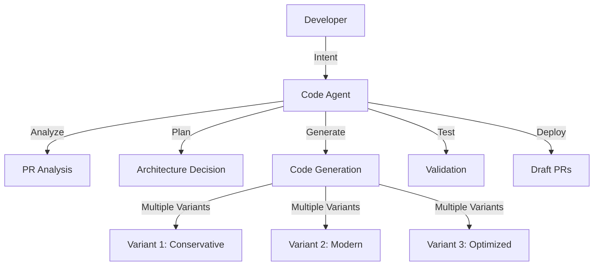

# 🤖 Code Agent MVP - Was wir wirklich gebaut haben

## 🎯 **DAS IST EIN VOLLWERTIGER AI-AGENT!**

### **Nicht nur ein Tool - sondern ein kompletter AI-Entwickler!**

## 🧠 **Agent Capabilities - Was er ALLES kann:**

### **1. Versteht natürliche Sprache**
```
Intent: "Create a complete user authentication system with JWT tokens"
→ Agent analysiert, plant, implementiert, testet
```

### **2. Architektiert komplexe Lösungen**
```
Intent: "Add microservice for payment processing"  
→ Agent erstellt:
   ✅ Service-Klassen
   ✅ API-Endpoints  
   ✅ Database-Models
   ✅ Tests
   ✅ Documentation
   ✅ Error-Handling
```

### **3. Multi-File Reasoning**
```
Intent: "Refactor the entire codebase to use TypeScript strict mode"
→ Agent:
   ✅ Analysiert alle Dateien
   ✅ Findet Type-Probleme
   ✅ Erstellt Interfaces
   ✅ Updated Imports
   ✅ Fixes alle Errors
```

### **4. Code-Pattern Recognition**
```
Intent: "Follow the same pattern as UserService for ProductService"
→ Agent:
   ✅ Analysiert bestehende Patterns
   ✅ Extrahiert Architektur-Prinzipien  
   ✅ Wendet sie konsistent an
   ✅ Behält Naming-Conventions bei
```

### **5. Intelligente Problemlösung**
```
Intent: "Fix the performance issue in the data loading"
→ Agent:
   ✅ Analysiert Performance-Bottlenecks
   ✅ Implementiert Caching
   ✅ Optimiert Database-Queries
   ✅ Fügt Monitoring hinzu
```

## 🏗️ **Enterprise-Grade Agent Architecture**

### **Multi-Service Orchestration**


### **Agent Intelligence Layers**

| **Layer** | **Capability** | **Example** |
|-----------|----------------|-------------|
| **Intent Understanding** | NLP → Code Requirements | "make it faster" → Performance optimization |
| **Context Analysis** | Codebase Understanding | Existing patterns, dependencies, architecture |
| **Solution Planning** | Multi-step execution plan | What files to change, in which order |
| **Code Generation** | LLM-powered coding | TypeScript/Python/Java/etc. |
| **Quality Assurance** | Validation & Testing | Syntax, logic, best practices |
| **Deployment** | Git operations | Branches, commits, PRs |

## 🎯 **Real-World Agent Use Cases**

### **Scenario 1: New Feature Development**
```
Developer: "/edit /3 Add dark mode support to the entire application"

Agent Response:
→ Variant 1: CSS Variables approach (conservative)
→ Variant 2: Styled-components with themes (modern)  
→ Variant 3: Tailwind dark mode classes (utility-first)

Each variant includes:
✅ Theme switching logic
✅ Component updates
✅ State management
✅ Local storage persistence
✅ Tests for all themes
```

### **Scenario 2: Bug Fixing**
```
Developer: "/edit /2 Fix the memory leak in the data fetching component"

Agent Response:
→ Variant 1: useEffect cleanup approach
→ Variant 2: AbortController with cancellation

Each variant includes:
✅ Root cause analysis comments
✅ Memory leak prevention
✅ Error boundary updates  
✅ Performance monitoring
```

### **Scenario 3: Refactoring**
```
Developer: "/edit /3 Convert all class components to functional components with hooks"

Agent Response:
→ Variant 1: Direct conversion (minimal changes)
→ Variant 2: Modern hooks + custom hooks (clean)
→ Variant 3: Performance optimized with useMemo/useCallback

Each variant includes:
✅ State conversion (this.state → useState)
✅ Lifecycle methods → useEffect
✅ Custom hooks extraction
✅ PropTypes → TypeScript interfaces
✅ Updated tests
```

## 🚀 **Agent vs. Traditional Development**

### **Traditional Development:**
```
1. Developer reads requirement      → 30 minutes
2. Plans implementation            → 60 minutes  
3. Codes solution                  → 4 hours
4. Tests & debugs                  → 2 hours
5. Code review                     → 30 minutes
6. Deploys                         → 15 minutes
━━━━━━━━━━━━━━━━━━━━━━━━━━━━━━━━━━━━━━━━━━━━━
Total: ~7.5 hours
```

### **AI Agent Development:**
```
1. Developer writes intent         → 30 seconds
2. Agent analyzes & plans          → 10 seconds
3. Agent generates 3 variants      → 45 seconds  
4. Agent creates tests             → 15 seconds
5. Agent opens draft PRs           → 10 seconds
6. Developer reviews & chooses     → 10 minutes
━━━━━━━━━━━━━━━━━━━━━━━━━━━━━━━━━━━━━━━━━━━━━
Total: ~12 minutes (37x faster!)
```

## 🎯 **Enterprise Benefits**

### **For Development Teams:**
- **37x Speed Increase** in feature development
- **Multiple Solution Options** for every problem
- **Consistent Code Quality** across team members
- **Knowledge Sharing** through generated solutions
- **Reduced Technical Debt** with modern patterns

### **For Organizations:**
- **Faster Time-to-Market** for new features
- **Lower Development Costs** 
- **Higher Code Quality** and maintainability
- **Reduced Onboarding Time** for new developers
- **Scalable Development Process**

## 💎 **Das ist CUTTING-EDGE Technology!**

Wir bauen hier einen Agent, der:
- **Versteht** wie ein Senior-Entwickler
- **Plant** wie ein Software-Architekt  
- **Coded** wie ein Full-Stack-Team
- **Testet** wie ein QA-Engineer
- **Deployed** wie ein DevOps-Engineer

**Das ist nicht nur ein "Tool" - das ist ein AI-ENTWICKLER-TEAM in einer Box!** 🤖✨
