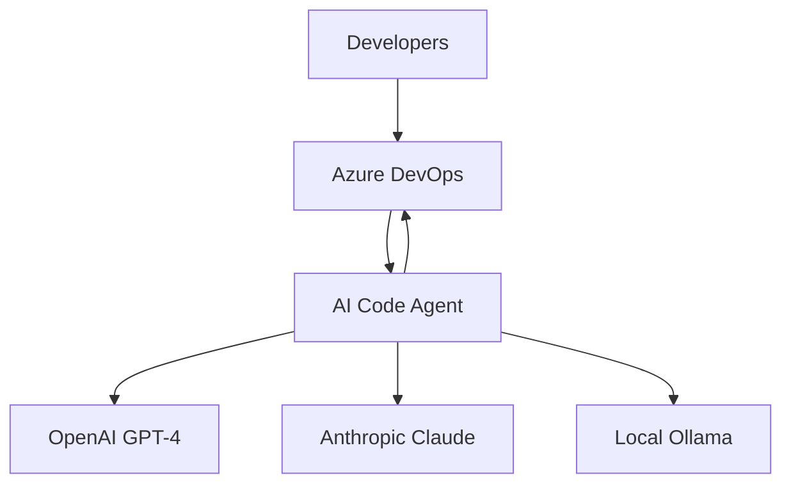

# AI Code Agent - Architecture Documentation (arc42)

## Table of Contents
1. [Introduction and Goals](#1-introduction-and-goals)
2. [Architecture Constraints](#2-architecture-constraints)
3. [Context and Scope](#3-context-and-scope)
4. [Solution Strategy](#4-solution-strategy)
5. [Building Block View](#5-building-block-view)

---

## 1. Introduction and Goals

### 1.1 Requirements Overview

**Primary Problem**: Development teams spend 40-60% of their time on repetitive coding tasks and manual code reviews, with poor integration of AI tools into existing DevOps workflows.

**Solution Vision**: An AI-powered code agent that automatically generates code patches in response to Azure DevOps pull request comments, seamlessly integrating into existing developer workflows.

### 1.2 Quality Goals

| Priority | Quality Goal | Scenario | Measurement |
|----------|--------------|----------|-------------|
| 1 | **Performance** | End-to-end webhook to draft PR in <15s (P95) | `llm_patch_generation_duration_seconds` |
| 2 | **Reliability** | 99.5% system availability with graceful degradation | `system_availability_percentage` |
| 3 | **Security** | Zero secret exposure, authenticated webhooks only | Security audit + `webhook_auth_failures_total` |
| 4 | **Usability** | Natural language intents with 95% success rate | `patch_generation_success_rate` |
| 5 | **Maintainability** | Provider-agnostic design for easy LLM switching | ADR compliance + code review |

### 1.3 Stakeholders

| Role | Contact | Expectations |
|------|---------|--------------|
| **Developers** | End Users | Simple, fast, high-quality code generation |
| **DevOps Team** | Platform Team | Reliable, observable, easy-to-deploy system |
| **Security Team** | Security Office | Secure handling of code and API keys |
| **Architecture Team** | Solution Architects | Standards compliance, scalable design |
| **Product Owner** | Business | Measurable productivity improvement |

---

## 2. Architecture Constraints

### 2.1 Technical Constraints

| Constraint | Background | Impact |
|------------|------------|--------|
| **Azure DevOps Integration** | Existing enterprise toolchain | Must use Azure DevOps REST API and webhooks |
| **Container-First Deployment** | Cloud-native strategy | All services must be containerized |
| **Multi-LLM Support** | Vendor independence | Provider-agnostic design required |
| **Local LLM Capability** | Privacy/compliance requirements | Must support offline operation |

### 2.2 Organizational Constraints

| Constraint | Description | Mitigation |
|------------|-------------|------------|
| **Security Policies** | No secrets in code/config | Azure Key Vault + Environment Variables |
| **Compliance Requirements** | Code privacy regulations | Local LLM option + audit trails |
| **Budget Limitations** | Cost-conscious LLM usage | Smart provider selection + local fallback |
| **Team Skills** | TypeScript/Node.js expertise | Leverage existing team capabilities |

### 2.3 Conventions

- **Programming Language**: TypeScript/Node.js for all services
- **API Design**: RESTful APIs with OpenAPI/Swagger documentation
- **Monitoring**: Prometheus metrics + Grafana dashboards
- **Documentation**: docs-as-code (Markdown + C4 Models)
- **Deployment**: Docker Compose (dev) → Azure Container Instances (prod)

---

## 3. Context and Scope

### 3.1 Business Context



**External Interfaces:**
- **Azure DevOps**: Webhook events, REST API for branch/PR management
- **LLM Providers**: OpenAI, Claude, local Ollama for code generation
- **Developers**: Natural language intents via PR comments

### 3.2 Technical Context

| Interface | Protocol | Data Format | Purpose |
|-----------|----------|-------------|---------|
| Azure DevOps Webhook | HTTPS | JSON | PR comment events |
| Azure DevOps API | REST/HTTPS | JSON | Branch/PR operations |
| OpenAI API | REST/HTTPS | JSON | GPT-4 code generation |
| Claude API | REST/HTTPS | JSON | Claude code generation |
| Ollama API | HTTP | JSON | Local LLM inference |

### 3.3 Scope Definition

**✅ In Scope:**
- Webhook-triggered code generation
- Multi-provider LLM integration
- Automated branch/PR creation
- Intent analysis and clarification
- Comprehensive monitoring

**❌ Out of Scope:**
- Real-time collaborative editing
- Direct database migrations
- Production deployment automation
- Multi-cloud support (Azure-first)

---

## 4. Solution Strategy

### 4.1 Technology Decisions

| Decision | Alternatives Considered | Rationale |
|----------|------------------------|-----------|
| **TypeScript/Node.js** | Python, C#, Go | Team expertise + rich ecosystem |
| **Microservices** | Monolith | Scalability + independent deployment |
| **Container Orchestration** | Kubernetes, Docker Compose | Simplicity for MVP (Compose) → scalability (K8s) |
| **Provider-Agnostic LLM** | Single provider | Vendor independence + fallback capability |
| **Prometheus + Grafana** | Azure Monitor only | Open source + portability |

### 4.2 Quality Achievement Strategy

| Quality Goal | Strategy | Implementation |
|--------------|----------|----------------|
| **Performance** | Async processing + caching | Queue-based workflow + Redis cache |
| **Reliability** | Circuit breaker + retry | Resilience patterns + health checks |
| **Security** | Defense in depth | Webhook auth + secret management + network isolation |
| **Maintainability** | Clean architecture | Domain-driven design + comprehensive testing |

### 4.3 Architecture Patterns

- **API Gateway Pattern**: Centralized request handling (Traefik)
- **Circuit Breaker**: LLM provider fallback mechanism
- **Event-Driven Architecture**: Webhook → workflow orchestration
- **Observer Pattern**: Comprehensive monitoring and alerting
- **Strategy Pattern**: Pluggable LLM providers

---

## 5. Building Block View

### 5.1 Whitebox Overall System

```
┌─────────────────────────────────────────────────────────┐
│                AI Code Agent System                     │
├─────────────────┬─────────────────┬─────────────────────┤
│   Presentation  │  Business Logic │   Infrastructure    │
│                 │                 │                     │
│  ┌───────────┐  │  ┌───────────┐  │  ┌─────────────┐    │
│  │ Gateway   │  │  │Orchestrator│  │  │ Monitoring  │    │
│  │ (3001)    │  │  │ (7071)     │  │  │ Stack       │    │
│  └───────────┘  │  └───────────┘  │  └─────────────┘    │
│                 │                 │                     │
│  ┌───────────┐  │  ┌───────────┐  │  ┌─────────────┐    │
│  │ Traefik   │  │  │ Adapter   │  │  │ Local LLM   │    │
│  │ (80/8080) │  │  │ (3002)    │  │  │ (11434)     │    │
│  └───────────┘  │  └───────────┘  │  └─────────────┘    │
│                 │                 │                     │
│                 │  ┌───────────┐  │  ┌─────────────┐    │
│                 │  │LLM-Patch  │  │  │ Storage     │    │
│                 │  │ (3003)    │  │  │ (Azurite)   │    │
│                 │  └───────────┘  │  └─────────────┘    │
└─────────────────┴─────────────────┴─────────────────────┘
```

### 5.2 Level 2 - Container Breakdown

#### 5.2.1 API Gateway (Port 3001)
**Responsibility**: Webhook validation, authentication, request routing
**Technology**: Fastify + Helmet + CORS
**Interfaces**: 
- IN: Azure DevOps webhooks (HTTPS)
- OUT: Orchestrator workflow triggers (HTTP)

#### 5.2.2 Workflow Orchestrator (Port 7071)  
**Responsibility**: End-to-end workflow coordination
**Technology**: Azure Functions (Durable Functions pattern)
**Interfaces**:
- IN: Gateway triggers (HTTP)
- OUT: Adapter + LLM-Patch services (HTTP)

#### 5.2.3 Azure DevOps Adapter (Port 3002)
**Responsibility**: Branch creation, PR management, status updates  
**Technology**: Fastify + Azure DevOps SDK
**Interfaces**:
- IN: Orchestrator requests (HTTP)
- OUT: Azure DevOps REST API (HTTPS)

#### 5.2.4 LLM Patch Service (Port 3003)
**Responsibility**: AI code generation with provider fallback
**Technology**: Fastify + multi-provider clients
**Interfaces**:
- IN: Orchestrator requests (HTTP)  
- OUT: OpenAI/Claude/Ollama APIs (HTTPS/HTTP)

### 5.3 Level 3 - Component Details

See C4 Component diagrams in `/docs/c4/workspace.dsl` for detailed internal component breakdown.

---

## Next Chapters (Future Iterations)

6. **Runtime View** - Key scenarios and workflow sequences
7. **Deployment View** - Infrastructure and environment mapping  
8. **Cross-cutting Concepts** - Logging, monitoring, security patterns
9. **Architecture Decisions** - Detailed ADR references
10. **Quality Requirements** - Detailed quality scenarios and measures
11. **Risks and Technical Debts** - Known limitations and mitigation strategies

---

**Document Status**: Living Document - Updated with each architecture change
**Last Updated**: 2025-09-09
**Next Review**: After MVP completion (Q1 2026)
