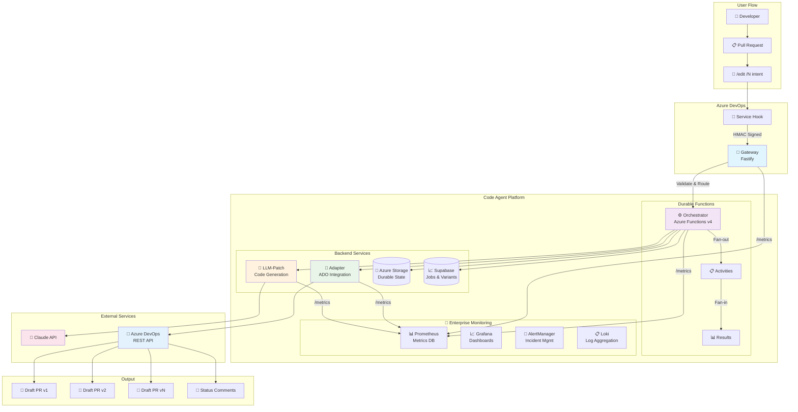
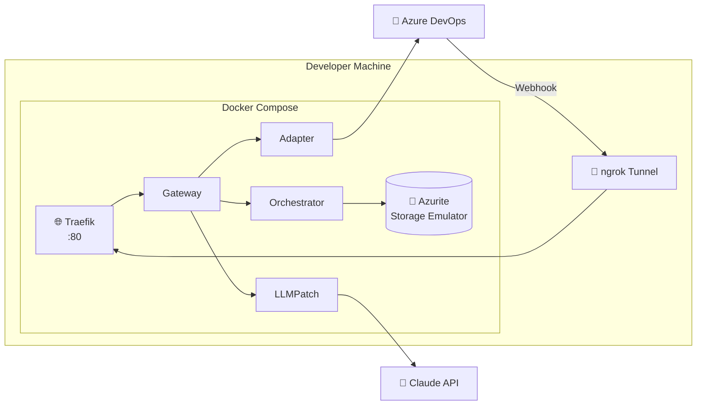
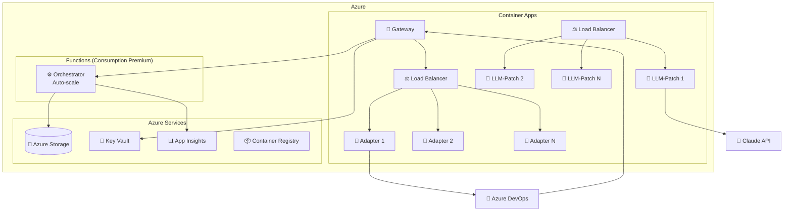
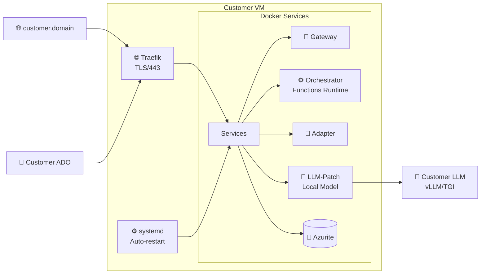
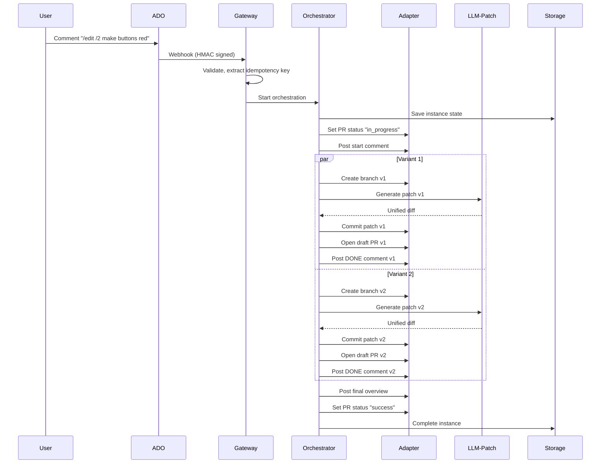
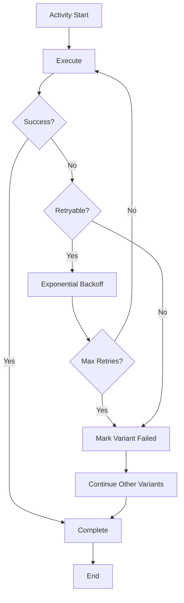
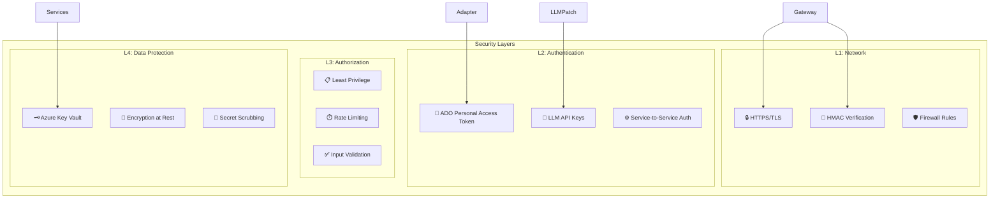
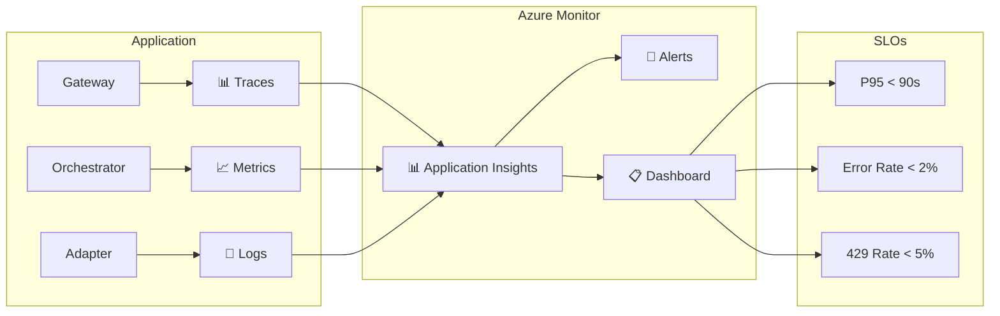

# Architektur - Code Agent MVP

## System-Übersicht



## Deployment-Varianten

### 1. Local Development (ngrok)



### 2. Azure Cloud (Horizontal Scaling)



### 3. Customer Server (Single VM)



## Datenfluss

### 1. Orchestration Flow



### 2. Error Handling & Retries



## Sicherheitsarchitektur



## Monitoring & Observability



## Branch & PR Naming Schema

```mermaid
flowchart TD
    Comment["/edit /3 make buttons red"] --> Parse[Parse Intent]
    Parse --> Slug[Generate Slug: "make-buttons-red"]
    Slug --> Branch1["users/alice/make-buttons-red/v1"]
    Slug --> Branch2["users/alice/make-buttons-red/v2"]
    Slug --> Branch3["users/alice/make-buttons-red/v3"]
    
    Branch1 --> PR1["🔧 AI Edit v1: make-buttons-red"]
    Branch2 --> PR2["🔧 AI Edit v2: make-buttons-red"]
    Branch3 --> PR3["🔧 AI Edit v3: make-buttons-red"]
```

## Legende

| Symbol | Bedeutung |
|--------|-----------|
| 🚪 | Gateway/Ingress |
| ⚙️ | Orchestrator/Engine |
| 🔌 | Adapter/Integration |
| 🧠 | LLM/AI Service |
| 💾 | Storage/Database |
| 🔒 | Security/Authentication |
| 📊 | Monitoring/Metrics |
| 🌐 | Network/Proxy |
| 📦 | Container/Package |
| 🤖 | External AI Service |
